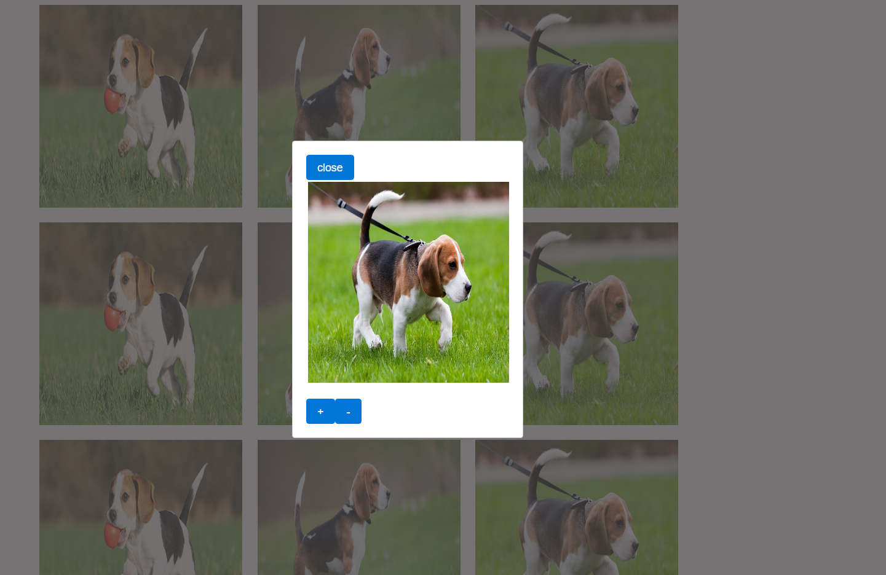

# Picture-Album-App
Simple Picture Album App using react-modal

####Download#####
Checkout this repo, install dependencies, then start the gulp process with the following:

```
	> git clone https://github.com/ShirH/Picture-Album-App.git
	> npm install
	> npm start
```

####Screenshots####


